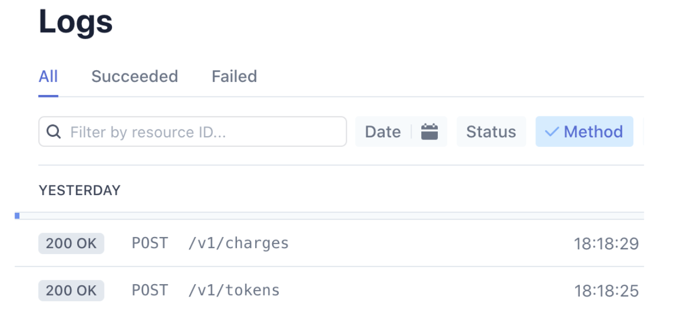

<br />

<p align="center">
  
  <h1 align="center">Stripe Payment System Integration with React</h1>

  <p align="center">
    <i>
    This checklist will complete the set up and integrate the stripe payment system within React.  You should have already completed the <a href="https://github.com/naomi-carey/Stripe-React-FE-Docs">frontend</a> checklist before the below steps.
      
      
  </i>
  <br />
  <br />
  <p align="center">
  <a href="https://github.com/naomi-carey/Stripe-React-FE-Docs">Frontend</a>
  ·
  <a href="https://github.com/naomi-carey/Stripe-React-BE-Docs">Backend</a>

</p>
</br>

# Table of Contents

- [Set up the backend ](#set-up-backend)
- [Start the backend ](#starting-the-backend)
- [Verify successful payment](#verify-success-payment)

</br>

# set-up-backend

1. Create backend directory.

```
cd ~/react-stripe-test
mkdir backend && cd backend
```

2. Install <a href="https://www.npmjs.com/package/express">Express</a>, <a href="https://www.npmjs.com/package/cors">CORS</a>, <a href="https://www.npmjs.com/package/body-parser">body-parser</a> and <a href="https://www.npmjs.com/package/stripe">Stripe</a>. 

```
npm init -y
npm install --save body-parser cors express stripe
```

3. Create the the **index.js** and **server.js** files in the backend directory:

```
touch index.js and server.js
```

4. Create two directories: **constants** and **routes**.

```
mkdir constants routes
```

5. Navigate to the **constants** directory and create **frontend.js**, **server.js**, and **stripe.js** files.

```
cd constants
touch frontend.js server.js stripe.js
```

6. Navigate to the **routes** directory and create the **index.js** and **payment.js** files.

```
cd ..
cd routes
touch index.js payment.js
```

7. In the **/backend/index.js** add the below code. This is configuring the backend server setup.

```javascript
const express = require("express");

const SERVER_CONFIGS = require("./constants/server");

const configureServer = require("./server");
const configureRoutes = require("./routes");

const app = express();

configureServer(app);
configureRoutes(app);

app.listen(SERVER_CONFIGS.PORT, (error) => {
  if (error) throw error;
  console.log("Server running on port: " + SERVER_CONFIGS.PORT);
});
```

8. In the **backend/constants/frontend.js** file, add following code: The below is restricting which server can be used to ping the backend.

```javascript
const FRONTEND_DEV_URLS = ["http://localhost:3000"];

const FRONTEND_PROD_URLS = [
  "https://www.yourdomain.com",
  "https://yourdomain.com",
];

module.exports =
  process.env.NODE_ENV === "production"
    ? FRONTEND_PROD_URLS
    : FRONTEND_DEV_URLS;
```

---

**NOTE:**
When the application is ready to deploy add the frontend production URLs to the following lines "FRONTEND_PROD_URLS" and "FRONTEND_DEV_URLS". For testing purposes add http://localhost:3000 in both areas.

---

9.  In the **constants/server.js** file add following code. Ensure the backend port number is correct. In the below example the backend server will be launched on http://localhost:8080) (port8080).

```javascript
const path = require("path");

const SERVER_PORT = 8080;

const SERVER_CONFIGS = {
  PRODUCTION: process.env.NODE_ENV === "production",
  PORT: process.env.PORT || SERVER_PORT,
};

module.exports = SERVER_CONFIGS;
```

10. In the **constants/stripe.js** file add the following code. This file contains the stripe credentials. Please update lines "sk_live_MY_SECRET_KEY" and "sk_test_MY_SECRET_KEY" with the secret keys found in the stripe dashboard. This part will remain confidential in the backend. Do not share these keys with anyone.

```javascript
const configureStripe = require("stripe");

const STRIPE_SECRET_KEY =
  process.env.NODE_ENV === "production"
    ? "sk_live_MY_SECRET_KEY"
    : "sk_test_MY_SECRET_KEY";

const stripe = configureStripe(STRIPE_SECRET_KEY);

module.exports = stripe;
```

---

**NOTE:**
Best practice is to hide the secret API keys in the .env file and replace "sk_live_MY_SECRET_KEY" and "sk_test_MY_SECRET_KEY" with “process.env.REACT_APP_STRIPE_KEY“. Then enter the secret API keys in the .env file.

---

11. In the **/backend/server.js** add the following code. The below is passing the CORS inbound text (whitelisted websites — which is the frontend address) and using bodyparser to parse out JSON details received.

```javascript
const cors = require("cors");
const bodyParser = require("body-parser");

const CORS_WHITELIST = require("./constants/frontend");

const corsOptions = {
  origin: (origin, callback) =>
    CORS_WHITELIST.indexOf(origin) !== -1
      ? callback(null, true)
      : callback(new Error("Not allowed by CORS")),
};

const configureServer = (app) => {
  app.use(cors(corsOptions));

  app.use(bodyParser.json());
};

module.exports = configureServer;
```

12. In the **routes/payment.js** file add the following code. If Stripe receives the data correctly it will send a 200 (OK) success response code. Otherwise it will send a 500 (internal server error) response code. This means the payment has NOT been successful.

```javascript
const stripe = require("../constants/stripe");

const postStripeCharge = (res) => (stripeErr, stripeRes) => {
  if (stripeErr) {
    res.status(500).send({ error: stripeErr });
  } else {
    res.status(200).send({ success: stripeRes });
  }
};

const paymentApi = (app) => {
  app.get("/", (req, res) => {
    res.send({
      message: "Hello Stripe checkout server!",
      timestamp: new Date().toISOString(),
    });
  });

  app.post("/", (req, res) => {
    stripe.charges.create(req.body, postStripeCharge(res));
  });

  return app;
};

module.exports = paymentApi;
```

13. In the **routes/index.js** file add the following code. This is running the payment API from **routes/payment.js**.

```javascript
const paymentApi = require("./payment");

const configureRoutes = (app) => {
  paymentApi(app);
};

module.exports = configureRoutes;
```

## starting-the-backend

14. This completes the backend setup. Now go to the backend’s root directory and start the server.

```
cd ~/backend
node index.js

```

---

If successful the backend server will start. Make sure both the backend (port 8080) and the frontend (port 3000) are running before trying to process a payment.

---

## verify-success-payment

15. Test the payment system. To process the payment with a credit card use the following test card numbers:

- Enter test number 4242 4242 4242 4242

- Enter any 3 digit CVC number

- Enter any future date

---

For other payment testing options see: https://stripe.com/docs/testing

---

16. To verify successful payment go to the Stripe dashboard. Under the tab Developers>>Logs the following will be displayed:
<p align="center">


---

One transaction should post a token and the next will post a charge. Both the token and charge need to post in order to successfully receive a payment.

---

## Related Articles:

- <a href="https://stripe.com/docs">Stripe Payment Documentation</a>
- <a href="https://stripe.com/docs/payments?payments=popular">Types of Stripe Payments</a>
- <a href="https://stripe.com/en-es/payments/payment-methods-guide">Guide to Payment Methods</a>

## [:top:](#table-of-contents)
